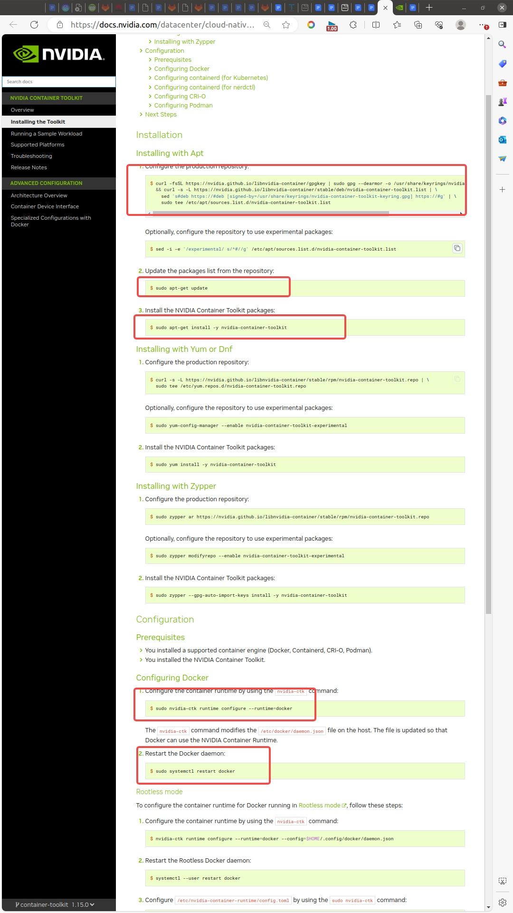

# docker_env

## docker 安装
### 1. 下文参考清华源镜像的安装方式 https://mirrors.tuna.tsinghua.edu.cn/help/docker-ce/
```bash
export DOWNLOAD_URL="https://mirrors.tuna.tsinghua.edu.cn/docker-ce"
sudo apt update && sudo apt install -y curl
curl -fsSL https://get.docker.com/ | sh 
```

最后一步如果失败，可能是因为网络问题，可以找一台可以打开 https://get.docker.com/ 的机器，将内容拷贝到机器内, 使用 sh 执行即可,这一步比较耗时。

### 2. 将用户加入 docker 组，以不使用 sudo 的方式运行 docker (**执行完需要重启**)
```bash
sudo usermod -aG docker $USER && newgrp docker
```

### 3. 创建daemon.json文件
```bash
sudo bash -c 'echo "{
\"registry-mirrors\": [
\"https://hub-mirror.c.163.com\",
\"https://docker.nju.edu.cn\",
\"https://dockerproxy.com\"
]
}" > /etc/docker/daemon.json'
```

### 4. 重启 Docker 守护进程：
```bash
sudo systemctl restart docker
```
### 5. 安装显卡对应的docker驱动
https://docs.nvidia.com/datacenter/cloud-native/container-toolkit/latest/install-guide.html
